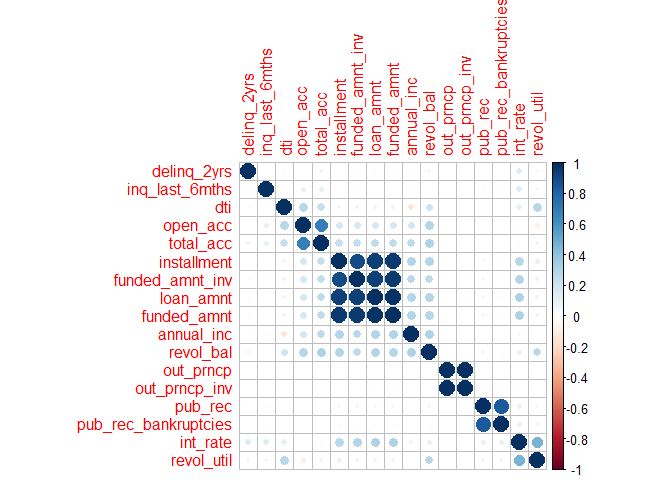

Predicting Credit Defaults
================
Bradley Gravitt, Max Kutschinski, Shree Karimkolikuzhiyil

12 April, 2022

# Overview

Insert text here

    ## [1] "Fully Paid" "Default"

    ## # A tibble: 2 x 2
    ## # Groups:   loan_status [2]
    ##   loan_status     n
    ##   <chr>       <int>
    ## 1 Default      6405
    ## 2 Fully Paid  33314

# Exploratory Analysis

## Missing Values

The goal of this section is to identify features that are eligible for
feature wise deletion in order to make the data set easier to navigate.
Part II discusses how to handle any remaining missing values. The
original dataset contains 39719 observations and 111 variables.

<!-- -->

The missingness plot indicates that a large amount of features consists
of a high percentage of missing values. The following output shows the
exact percentages per feature.

    ##                             id                      member_id 
    ##                          0.000                          0.000 
    ##                      loan_amnt                    funded_amnt 
    ##                          0.000                          0.000 
    ##                funded_amnt_inv                           term 
    ##                          0.000                          0.000 
    ##                       int_rate                    installment 
    ##                          0.000                          0.000 
    ##                          grade                      sub_grade 
    ##                          0.000                          0.000 
    ##                      emp_title                     emp_length 
    ##                          6.181                          0.000 
    ##                 home_ownership                     annual_inc 
    ##                          0.000                          0.000 
    ##            verification_status                        issue_d 
    ##                          0.000                          0.000 
    ##                    loan_status                     pymnt_plan 
    ##                          0.000                          0.000 
    ##                            url                           desc 
    ##                          0.000                         32.634 
    ##                        purpose                          title 
    ##                          0.000                          0.025 
    ##                       zip_code                     addr_state 
    ##                          0.000                          0.000 
    ##                            dti                    delinq_2yrs 
    ##                          0.000                          0.008 
    ##               earliest_cr_line                 inq_last_6mths 
    ##                          0.008                          0.008 
    ##         mths_since_last_delinq         mths_since_last_record 
    ##                         64.088                         92.311 
    ##                       open_acc                        pub_rec 
    ##                          0.008                          0.008 
    ##                      revol_bal                     revol_util 
    ##                          0.000                          0.141 
    ##                      total_acc            initial_list_status 
    ##                          0.008                          0.000 
    ##                      out_prncp                  out_prncp_inv 
    ##                          0.000                          0.000 
    ##                    total_pymnt                total_pymnt_inv 
    ##                          0.000                          0.000 
    ##                total_rec_prncp                  total_rec_int 
    ##                          0.000                          0.000 
    ##             total_rec_late_fee                     recoveries 
    ##                          0.000                          0.000 
    ##        collection_recovery_fee                   last_pymnt_d 
    ##                          0.000                          0.209 
    ##                last_pymnt_amnt                   next_pymnt_d 
    ##                          0.000                         98.074 
    ##             last_credit_pull_d     collections_12_mths_ex_med 
    ##                          0.005                          0.196 
    ##    mths_since_last_major_derog                    policy_code 
    ##                        100.000                          0.000 
    ##               application_type               annual_inc_joint 
    ##                          0.000                        100.000 
    ##                      dti_joint      verification_status_joint 
    ##                        100.000                        100.000 
    ##                 acc_now_delinq                   tot_coll_amt 
    ##                          0.008                        100.000 
    ##                    tot_cur_bal                    open_acc_6m 
    ##                        100.000                        100.000 
    ##                     open_il_6m                    open_il_12m 
    ##                        100.000                        100.000 
    ##                    open_il_24m             mths_since_rcnt_il 
    ##                        100.000                        100.000 
    ##                   total_bal_il                        il_util 
    ##                        100.000                        100.000 
    ##                    open_rv_12m                    open_rv_24m 
    ##                        100.000                        100.000 
    ##                     max_bal_bc                       all_util 
    ##                        100.000                        100.000 
    ##               total_rev_hi_lim                         inq_fi 
    ##                        100.000                        100.000 
    ##                    total_cu_tl                   inq_last_12m 
    ##                        100.000                        100.000 
    ##           acc_open_past_24mths                    avg_cur_bal 
    ##                        100.000                        100.000 
    ##                 bc_open_to_buy                        bc_util 
    ##                        100.000                        100.000 
    ##       chargeoff_within_12_mths                    delinq_amnt 
    ##                          0.196                          0.008 
    ##             mo_sin_old_il_acct           mo_sin_old_rev_tl_op 
    ##                        100.000                        100.000 
    ##          mo_sin_rcnt_rev_tl_op                 mo_sin_rcnt_tl 
    ##                        100.000                        100.000 
    ##                       mort_acc           mths_since_recent_bc 
    ##                        100.000                        100.000 
    ##       mths_since_recent_bc_dlq          mths_since_recent_inq 
    ##                        100.000                        100.000 
    ## mths_since_recent_revol_delinq          num_accts_ever_120_pd 
    ##                        100.000                        100.000 
    ##                 num_actv_bc_tl                num_actv_rev_tl 
    ##                        100.000                        100.000 
    ##                    num_bc_sats                      num_bc_tl 
    ##                        100.000                        100.000 
    ##                      num_il_tl                  num_op_rev_tl 
    ##                        100.000                        100.000 
    ##                  num_rev_accts            num_rev_tl_bal_gt_0 
    ##                        100.000                        100.000 
    ##                       num_sats               num_tl_120dpd_2m 
    ##                        100.000                        100.000 
    ##                   num_tl_30dpd             num_tl_90g_dpd_24m 
    ##                        100.000                        100.000 
    ##             num_tl_op_past_12m                 pct_tl_nvr_dlq 
    ##                        100.000                        100.000 
    ##               percent_bc_gt_75           pub_rec_bankruptcies 
    ##                        100.000                          2.299 
    ##                      tax_liens                tot_hi_cred_lim 
    ##                          0.123                        100.000 
    ##              total_bal_ex_mort                 total_bc_limit 
    ##                        100.000                        100.000 
    ##     total_il_high_credit_limit 
    ##                        100.000

Thus, it makes sense to delete features with a large percentage of
missing values. The general rule of thumb is to delete any features with
33% or more.

After dropping the features that fall into this category, 54 variables
remain in the dataset. Before using any kind of imputation method the
data is split into a training and test set. Imputation is only performed
on the features of the training set. Mode imputation is used for
qualitative features, and median imputation is used for quantitative
features.

## Data structures

The following section of code explores the data structures in order to
identify any qualitative features that might be coded as quantitative
features and vice versa. First, the number of features per data type is
displayed.

    ## 
    ## character   logical   numeric 
    ##        22         1        31

To get a closer look at the data types for each feature, the following
output can be used.

    ## tibble [39,719 x 54] (S3: tbl_df/tbl/data.frame)
    ##  $ id                        : num [1:39719] 1077501 1077430 1077175 1076863 1075269 ...
    ##  $ member_id                 : num [1:39719] 1296599 1314167 1313524 1277178 1311441 ...
    ##  $ loan_amnt                 : num [1:39719] 5000 2500 2400 10000 5000 ...
    ##  $ funded_amnt               : num [1:39719] 5000 2500 2400 10000 5000 ...
    ##  $ funded_amnt_inv           : num [1:39719] 4975 2500 2400 10000 5000 ...
    ##  $ term                      : chr [1:39719] "36 months" "60 months" "36 months" "36 months" ...
    ##  $ int_rate                  : chr [1:39719] "10.65%" "15.27%" "15.96%" "13.49%" ...
    ##  $ installment               : num [1:39719] 162.9 59.8 84.3 339.3 156.5 ...
    ##  $ grade                     : chr [1:39719] "B" "C" "C" "C" ...
    ##  $ sub_grade                 : chr [1:39719] "B2" "C4" "C5" "C1" ...
    ##  $ emp_title                 : chr [1:39719] NA "Ryder" NA "AIR RESOURCES BOARD" ...
    ##  $ emp_length                : chr [1:39719] "10+ years" "< 1 year" "10+ years" "10+ years" ...
    ##  $ home_ownership            : chr [1:39719] "RENT" "RENT" "RENT" "RENT" ...
    ##  $ annual_inc                : num [1:39719] 24000 30000 12252 49200 36000 ...
    ##  $ verification_status       : chr [1:39719] "Verified" "Source Verified" "Not Verified" "Source Verified" ...
    ##  $ issue_d                   : chr [1:39719] "11-Dec" "11-Dec" "11-Dec" "11-Dec" ...
    ##  $ loan_status               : chr [1:39719] "Fully Paid" "Default" "Fully Paid" "Fully Paid" ...
    ##  $ pymnt_plan                : chr [1:39719] "n" "n" "n" "n" ...
    ##  $ url                       : chr [1:39719] "https://lendingclub.com/browse/loanDetail.action?loan_id=1077501" "https://lendingclub.com/browse/loanDetail.action?loan_id=1077430" "https://lendingclub.com/browse/loanDetail.action?loan_id=1077175" "https://lendingclub.com/browse/loanDetail.action?loan_id=1076863" ...
    ##  $ desc                      : chr [1:39719] "Borrower added on 12/22/11 > I need to upgrade my business technologies. " "Borrower added on 12/22/11 > I plan to use this money to finance the motorcycle i am looking at. I plan to have"| __truncated__ NA "Borrower added on 12/21/11 > to pay for property tax (borrow from friend, need to pay back) & central A/C need "| __truncated__ ...
    ##  $ purpose                   : chr [1:39719] "credit_card" "car" "small_business" "other" ...
    ##  $ title                     : chr [1:39719] "Computer" "bike" "real estate business" "personel" ...
    ##  $ zip_code                  : chr [1:39719] "860xx" "309xx" "606xx" "917xx" ...
    ##  $ addr_state                : chr [1:39719] "AZ" "GA" "IL" "CA" ...
    ##  $ dti                       : num [1:39719] 27.65 1 8.72 20 11.2 ...
    ##  $ delinq_2yrs               : num [1:39719] 0 0 0 0 0 0 0 0 0 0 ...
    ##  $ earliest_cr_line          : chr [1:39719] "Jan-85" "Apr-99" "1-Nov" "Feb-96" ...
    ##  $ inq_last_6mths            : num [1:39719] 1 5 2 1 3 1 2 2 0 2 ...
    ##  $ open_acc                  : num [1:39719] 3 3 2 10 9 7 4 11 2 14 ...
    ##  $ pub_rec                   : num [1:39719] 0 0 0 0 0 0 0 0 0 0 ...
    ##  $ revol_bal                 : num [1:39719] 13648 1687 2956 5598 7963 ...
    ##  $ revol_util                : chr [1:39719] "83.70%" "9.40%" "98.50%" "21%" ...
    ##  $ total_acc                 : num [1:39719] 9 4 10 37 12 11 4 13 3 23 ...
    ##  $ initial_list_status       : logi [1:39719] FALSE FALSE FALSE FALSE FALSE FALSE ...
    ##  $ out_prncp                 : num [1:39719] 0 0 0 0 0 0 0 0 0 0 ...
    ##  $ out_prncp_inv             : num [1:39719] 0 0 0 0 0 0 0 0 0 0 ...
    ##  $ total_pymnt               : num [1:39719] 5863 1009 3006 12232 5632 ...
    ##  $ total_pymnt_inv           : num [1:39719] 5834 1009 3006 12232 5632 ...
    ##  $ total_rec_prncp           : num [1:39719] 5000 456 2400 10000 5000 ...
    ##  $ total_rec_int             : num [1:39719] 863 435 606 2215 632 ...
    ##  $ total_rec_late_fee        : num [1:39719] 0 0 0 17 0 ...
    ##  $ recoveries                : num [1:39719] 0 117 0 0 0 ...
    ##  $ collection_recovery_fee   : num [1:39719] 0 1.11 0 0 0 0 0 2.09 2.52 0 ...
    ##  $ last_pymnt_d              : chr [1:39719] "15-Jan" "13-Apr" "14-Jun" "15-Jan" ...
    ##  $ last_pymnt_amnt           : num [1:39719] 172 120 650 357 161 ...
    ##  $ last_credit_pull_d        : chr [1:39719] "16-Jul" "13-Sep" "16-Jul" "16-Apr" ...
    ##  $ collections_12_mths_ex_med: num [1:39719] 0 0 0 0 0 0 0 0 0 0 ...
    ##  $ policy_code               : num [1:39719] 1 1 1 1 1 1 1 1 1 1 ...
    ##  $ application_type          : chr [1:39719] "INDIVIDUAL" "INDIVIDUAL" "INDIVIDUAL" "INDIVIDUAL" ...
    ##  $ acc_now_delinq            : num [1:39719] 0 0 0 0 0 0 0 0 0 0 ...
    ##  $ chargeoff_within_12_mths  : num [1:39719] 0 0 0 0 0 0 0 0 0 0 ...
    ##  $ delinq_amnt               : num [1:39719] 0 0 0 0 0 0 0 0 0 0 ...
    ##  $ pub_rec_bankruptcies      : num [1:39719] 0 0 0 0 0 0 0 0 0 0 ...
    ##  $ tax_liens                 : num [1:39719] 0 0 0 0 0 0 0 0 0 0 ...

Furthermore, the number of unique values per features are displayed.

    ##                         id                  member_id 
    ##                      39719                      39719 
    ##                  loan_amnt                funded_amnt 
    ##                        880                       1029 
    ##            funded_amnt_inv                       term 
    ##                       8473                          2 
    ##                   int_rate                installment 
    ##                        389                      15485 
    ##                      grade                  sub_grade 
    ##                          7                         35 
    ##                  emp_title                 emp_length 
    ##                      28624                         12 
    ##             home_ownership                 annual_inc 
    ##                          5                       5327 
    ##        verification_status                    issue_d 
    ##                          3                         55 
    ##                loan_status                 pymnt_plan 
    ##                          2                          2 
    ##                        url                       desc 
    ##                      39719                      26702 
    ##                    purpose                      title 
    ##                         14                      19607 
    ##                   zip_code                 addr_state 
    ##                        830                         50 
    ##                        dti                delinq_2yrs 
    ##                       2865                         12 
    ##           earliest_cr_line             inq_last_6mths 
    ##                        527                         23 
    ##                   open_acc                    pub_rec 
    ##                         43                          6 
    ##                  revol_bal                 revol_util 
    ##                      21672                       1099 
    ##                  total_acc        initial_list_status 
    ##                         84                          1 
    ##                  out_prncp              out_prncp_inv 
    ##                          5                          5 
    ##                total_pymnt            total_pymnt_inv 
    ##                      37818                      37436 
    ##            total_rec_prncp              total_rec_int 
    ##                       7612                      35034 
    ##         total_rec_late_fee                 recoveries 
    ##                       1469                       4517 
    ##    collection_recovery_fee               last_pymnt_d 
    ##                       2842                        106 
    ##            last_pymnt_amnt         last_credit_pull_d 
    ##                      35153                        110 
    ## collections_12_mths_ex_med                policy_code 
    ##                          2                          1 
    ##           application_type             acc_now_delinq 
    ##                          1                          2 
    ##   chargeoff_within_12_mths                delinq_amnt 
    ##                          2                          2 
    ##       pub_rec_bankruptcies                  tax_liens 
    ##                          4                          2

There are some qualitative features, some coded as character and some as
numeric, that need to be converted to factors. In addition, it seems
like some features only have one value (besides NA) and should therefore
be dropped. After making some transformations, the dataset looks as
follows.

    ## 
    ##  factor numeric 
    ##      10      17

    ## tibble [39,719 x 10] (S3: tbl_df/tbl/data.frame)
    ##  $ term               : Factor w/ 2 levels "36 months","60 months": 1 2 1 1 1 2 1 2 2 2 ...
    ##  $ grade              : Factor w/ 7 levels "A","B","C","D",..: 2 3 3 3 1 3 5 6 2 3 ...
    ##  $ sub_grade          : Factor w/ 35 levels "A1","A2","A3",..: 7 14 15 11 4 15 21 27 10 13 ...
    ##  $ home_ownership     : Factor w/ 5 levels "MORTGAGE","NONE",..: 5 5 5 5 5 5 5 4 5 4 ...
    ##  $ verification_status: Factor w/ 3 levels "Not Verified",..: 3 2 1 2 2 1 2 2 3 1 ...
    ##  $ loan_status        : Factor w/ 2 levels "Default","Fully Paid": 2 1 2 2 2 2 2 1 1 2 ...
    ##  $ pymnt_plan         : Factor w/ 2 levels "n","y": 1 1 1 1 1 1 1 1 1 1 ...
    ##  $ purpose            : Factor w/ 14 levels "car","credit_card",..: 2 1 12 10 14 3 1 12 10 3 ...
    ##  $ addr_state         : Factor w/ 50 levels "AK","AL","AR",..: 4 11 15 5 4 28 5 5 43 4 ...
    ##  $ emp_length         : Factor w/ 12 levels "< 1 year","1 year",..: 3 1 3 3 5 10 11 6 1 7 ...

    ## tibble [39,719 x 17] (S3: tbl_df/tbl/data.frame)
    ##  $ loan_amnt           : num [1:39719] 5000 2500 2400 10000 5000 ...
    ##  $ funded_amnt         : num [1:39719] 5000 2500 2400 10000 5000 ...
    ##  $ funded_amnt_inv     : num [1:39719] 4975 2500 2400 10000 5000 ...
    ##  $ int_rate            : num [1:39719] 10.6 15.3 16 13.5 7.9 ...
    ##  $ installment         : num [1:39719] 162.9 59.8 84.3 339.3 156.5 ...
    ##  $ annual_inc          : num [1:39719] 24000 30000 12252 49200 36000 ...
    ##  $ dti                 : num [1:39719] 27.65 1 8.72 20 11.2 ...
    ##  $ delinq_2yrs         : num [1:39719] 0 0 0 0 0 0 0 0 0 0 ...
    ##  $ inq_last_6mths      : num [1:39719] 1 5 2 1 3 1 2 2 0 2 ...
    ##  $ open_acc            : num [1:39719] 3 3 2 10 9 7 4 11 2 14 ...
    ##  $ pub_rec             : num [1:39719] 0 0 0 0 0 0 0 0 0 0 ...
    ##  $ revol_bal           : num [1:39719] 13648 1687 2956 5598 7963 ...
    ##  $ revol_util          : num [1:39719] 83.7 9.4 98.5 21 28.3 85.6 87.5 32.6 36.5 20.6 ...
    ##  $ total_acc           : num [1:39719] 9 4 10 37 12 11 4 13 3 23 ...
    ##  $ out_prncp           : num [1:39719] 0 0 0 0 0 0 0 0 0 0 ...
    ##  $ out_prncp_inv       : num [1:39719] 0 0 0 0 0 0 0 0 0 0 ...
    ##  $ pub_rec_bankruptcies: num [1:39719] 0 0 0 0 0 0 0 0 0 0 ...

## Removing correlated variables

Quantitative features with high correlation (p\>0.85) are problematic
and should removed as a result.

<!-- -->

The correlation plot indicates that there are a few features with high
correlation in the dataset that should be removed.

## Extreme observations and skewness

Principal components analysis is used to check for extreme observations.
However, it is important to check for skewness first. Assuming that
acceptable values of skewness fall between -1,5 and 1.5, features with
values for skewness outside of this range are transformed.

    ##      funded_amnt_inv             int_rate           annual_inc 
    ##           1.11244554           0.27995196          16.89271251 
    ##                  dti          delinq_2yrs       inq_last_6mths 
    ##          -0.02511325           5.09625206           2.90952179 
    ##             open_acc              pub_rec            revol_bal 
    ##           1.03683566           4.64088610           5.41182470 
    ##           revol_util            total_acc        out_prncp_inv 
    ##          -0.03134449           0.83118809         104.46060904 
    ## pub_rec_bankruptcies 
    ##           4.60326809

The output indicates that some features are heavily skewed.

Extreme observations can be identified via the following PCA output.

<!-- -->  
No immediate extreme observations apparent.

# Methods

    ## [1] 29790    22

    ##  [1] "term"                 "grade"                "sub_grade"           
    ##  [4] "home_ownership"       "verification_status"  "pymnt_plan"          
    ##  [7] "purpose"              "addr_state"           "emp_length"          
    ## [10] "funded_amnt_inv"      "int_rate"             "annual_inc"          
    ## [13] "dti"                  "delinq_2yrs"          "inq_last_6mths"      
    ## [16] "open_acc"             "pub_rec"              "revol_bal"           
    ## [19] "revol_util"           "total_acc"            "out_prncp_inv"       
    ## [22] "pub_rec_bankruptcies"

## Logistic elastic net

## SVM

# Results

# Conclusion
